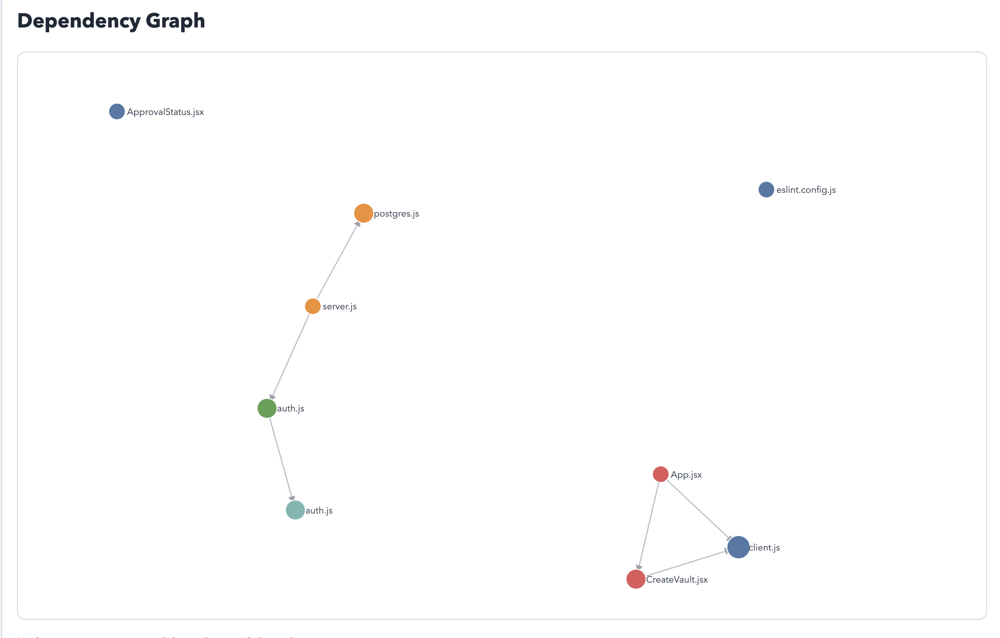

# CodeNarrator

**An autonomous codebase understanding agent.**

CodeNarrator ingests any Git repository and autonomously explores it — inspecting files, building a dependency graph, tracking its own understanding over time, and producing an AI-generated architectural summary. After giving it a repo URL, it decides which files to inspect, when it has learned enough to stop, and how to interpret what it found. No human guidance required between input and output.

Built as a local-first FastAPI backend with a Qwen2.5-Coder 7B model running via Ollama.

---

## What It Does

```
Git URL
  → Clone repo locally
  → Build initial understanding snapshot
  → Run iterative exploration loop
  → Extract imports and build dependency graph
  → Resolve internal file-to-file edges
  → Call local AI model for architectural interpretation
  → Generate self-contained HTML report
```

Given a repo like `https://github.com/user/project`, CodeNarrator produces:

- Which files are architectural entry points
- How files depend on each other (resolved internal edges)
- Which files form clusters of related functionality
- An AI-generated breakdown of main components and their relationships
- A plain English summary a new developer can read to understand the codebase

---

## Demo Output

**Dependency graph summary for a frontend/backend repo:**
```json
{
  "internal_edges": [
    {"from": "frontend/src/App.jsx", "to": "frontend/src/api/client.js"},
    {"from": "server/server.js", "to": "server/routes/auth.js"},
    {"from": "server/routes/auth.js", "to": "server/services/authService.js"}
  ],
  "clusters": [
    {"cluster": "react", "files": ["frontend/src/App.jsx", "frontend/src/pages/CreateVault.jsx"]},
    {"cluster": "express", "files": ["server/routes/auth.js", "server/server.js"]}
  ]
}
```

**AI interpretation:**
```json
{
  "architecture_pattern": "Client-Server",
  "main_components": [
    {
      "name": "Frontend",
      "files": ["frontend/src/App.jsx", "frontend/src/pages/CreateVault.jsx"],
      "description": "React application handling user interface and interactions"
    },
    {
      "name": "Backend",
      "files": ["server/server.js", "server/routes/auth.js", "server/services/authService.js"],
      "description": "Express server managing authentication and business logic"
    }
  ],
  "summary_for_new_developer": "This repository has a clear frontend/backend separation. The frontend is a React app that communicates with an Express backend through an API client. The backend manages authentication via a service layer and persists data through a Postgres connection."
}
```

---
## Example Report



---

## Architecture

### System Overview

```
┌─────────────────────────────────────────────────────────────┐
│                        FastAPI Backend                       │
│                                                             │
│  POST /repos/ingest                                         │
│       ↓                                                     │
│  GitPython clone → local disk                               │
│                                                             │
│  POST /repos/snapshot                                       │
│       ↓                                                     │
│  repo_scanner + repo_metadata → analysis_state (memory)    │
│                                                             │
│  POST /repos/snapshot/run                                   │
│       ↓                                                     │
│  Analysis Loop:                                             │
│    score candidates → inspect file → update state          │
│    → refresh candidates → check progress → repeat          │
│       ↓                                                     │
│  dependency_graph_summary (edges, clusters, rankings)      │
│                                                             │
│  POST /repos/interpret                                      │
│       ↓                                                     │
│  Ollama (Qwen2.5-Coder 7B) → structured interpretation     │
│                                                             │
│  POST /repos/report                                         │
│       ↓                                                     │
│  Self-contained HTML report with D3.js graph               │
└─────────────────────────────────────────────────────────────┘
```

### Core Components

#### Analysis State
The central memory object that flows through the entire system. Tracks everything the agent has observed and decided:

```python
{
  "repo_id": str,
  "explored_files": list[str],        # files already inspected
  "candidate_files": list[dict],      # files ranked for next inspection
  "inspected_facts": list[dict],      # what was learned from each file
  "dependency_edges": list[dict],     # raw import data per file
  "dependency_graph_summary": dict,   # resolved edges, clusters, rankings
  "unknowns": list[str],              # explicitly unresolved questions
  "current_summary": dict,            # evolving repo understanding
  "confidence": float,                # evidence-based confidence 0.0-0.95
  "no_progress_steps": int,           # consecutive steps with no new signal
  "stop_reason": str | None           # why the loop stopped
}
```

#### The Analysis Loop

The loop is the core agentic behavior. Each step:

1. **Select** — score all unexplored files, pick highest signal candidate
2. **Inspect** — read file, extract language, line count, role hint, imports
3. **Record** — store inspected facts in state
4. **Refine** — update summary if new entry points or directories discovered
5. **Reduce** — clear unknowns that the inspected file resolves
6. **Update confidence** — increase only when real evidence found
7. **Refresh candidates** — re-rank all unexplored files based on new state
8. **Check progress** — if 2 consecutive steps taught nothing, stop

The loop stops when:
- `no_progress_steps >= 2` → "No meaningful progress in 2 consecutive steps"
- No candidates remain → "No more meaningful candidates available"
- `max_steps` reached

#### Candidate Scoring

Every unexplored file is scored for information gain:

| Signal | Score |
|--------|-------|
| Entry point filename match | +8 |
| Can resolve entry point unknown | +5 |
| New language not yet seen | +4 |
| Central architecture file (server.js, main.py, etc.) | +4 |
| New directory not yet explored | +3 |
| New file role not yet seen | +2 |
| New top-level domain signal | +2 |
| Test or docs directory | −2 |

The highest scoring unexplored file is always inspected next. This implements information gain based exploration — the agent always tries to learn the most from each step.

#### Evidence-Based Confidence

Confidence increases only when the loop actually discovers something new:

| Evidence | Delta |
|----------|-------|
| New entry point discovered | +0.10 |
| New top-level directory signal | +0.05 |
| Unknown cleared | +0.03 per unknown |
| Materially new inspected fact | +0.04 |

Starting confidence is capped at 0.70 before any file inspection. A well-structured repo starts around 0.68. A weak/ambiguous repo starts around 0.34. This ensures the loop has meaningful room to demonstrate learning.

Confidence is capped at 0.95 — never 1.0 — because complete understanding from static analysis alone is not achievable.

#### Dependency Mapping

During each file inspection, imports are extracted and stored:

**Python** — AST parser first, regex fallback:
- `import X` and `from X import Y` forms
- Relative imports: `from . import X`, `from ..utils import Y`

**JavaScript/JSX** — regex based:
- ES modules: `import X from 'Y'`
- CommonJS: `require('Y')`

**Internal edge resolution** — relative imports are resolved to actual repo files:
- `./pages/CreateVault` → tries `.js`, `.jsx`, `.ts`, `.tsx`, `/index.js` variants
- Edge only created if target file exists in the scanned repo
- External libraries (`react`, `express`, `numpy`) remain unresolved as external dependencies

#### AI Interpretation

After the loop completes, the final state is passed to a local Ollama model:

**Input to model:**
- `internal_edges` — resolved file-to-file connections
- `clusters` — groups of files sharing import patterns
- `highest_dependency_files` — most connected files
- `inspected_facts` — file paths, languages, role hints, imported modules

**Output from model:**
```json
{
  "architecture_pattern": "...",
  "main_components": [{"name", "files", "description"}],
  "key_dependencies": [{"from", "to", "reason"}],
  "summary_for_new_developer": "..."
}
```

The AI layer is **optional and non-blocking**. If Ollama is unreachable, times out, or returns malformed JSON, the system returns `null` for interpretation and continues. The deterministic analysis is always available.

---

## Key Design Decisions

**Why deterministic first, AI second**

Deterministic logic is testable, debuggable, and explainable. If AI controlled the exploration loop, you would lose visibility into why decisions were made and have no reliable fallback when the model fails. The deterministic layer provides a stable foundation that AI enhances rather than replaces.

**Why evidence-based confidence instead of step-based**

Step-based confidence is meaningless — you could reach high confidence by inspecting ten identical files. Evidence-based confidence means the score reflects actual understanding gained. If the loop explores 5 files and all are in the same directory with the same role, confidence stays low because nothing new was learned.

**Why separate snapshot from loop execution**

Snapshot is one-time static observation. The loop is iterative reasoning. Mixing them would mean you cannot restart the loop from the same starting point, cannot compare different loop strategies, and cannot evaluate loop quality independently. The snapshot gives you a clean, reproducible starting state.

**Why no-progress detection matters**

Without it, the loop would always run to `max_steps` regardless of whether it was learning anything. The no-progress rule makes the agent self-aware about when exploration has become redundant — a fundamental property of well-designed autonomous systems.

**Why local-first**

No cloud costs, no latency, no data privacy concerns. A developer can run CodeNarrator against a private proprietary codebase without any data leaving their machine. Ollama runs the model locally with no external API calls.

**Why internal edge resolution matters**

Raw relative imports (`./pages/CreateVault`) stored as strings tell you nothing about component relationships. Resolved internal edges tell you exactly which files depend on which other files — the actual architectural wiring of the codebase.

---

## Tech Stack

| Layer | Technology | Why |
|-------|-----------|-----|
| API framework | FastAPI | Native Pydantic integration, async support, automatic OpenAPI docs |
| Data validation | Pydantic v2 | Request/response validation at API boundary, clean model definitions |
| Repo cloning | GitPython | Programmatic Git operations, local-first cloning |
| Python AST parsing | `ast` (stdlib) | Zero-dependency, reliable import extraction for Python files |
| JS import extraction | Regex | No Node.js dependency needed for pattern-based extraction |
| AI model | Qwen2.5-Coder 7B | Code-aware, runs locally on 16GB RAM MacBook, strong structured output |
| Model serving | Ollama | Local model inference, simple REST API, no API billing |
| Visualization | D3.js (CDN) | Force-directed graph, well-documented, no build step required |
| Report format | Self-contained HTML | Opens in any browser, no server needed, shareable as a single file |

---

## API Reference

### `POST /api/v1/repos/ingest`
Clone a remote repository locally.

```json
// Request
{"repo_url": "https://github.com/user/repo", "force_clean": false}

// Response
{"repo_url": "...", "local_path": "data/repos/...", "status": "ready"}
```

### `POST /api/v1/repos/snapshot`
Build initial analysis state from an ingested repo.

```json
// Request
{"local_path": "data/repos/github.com__user__repo"}

// Response
{
  "repo_summary": {...},
  "next_candidates": [...],
  "unknowns": [...],
  "confidence": 0.62,
  "analysis_state": {...}
}
```

### `POST /api/v1/repos/snapshot/run`
Run the analysis loop from an initial state.

```json
// Request
{"analysis_state": {...}, "max_steps": 10}

// Response
{
  "steps_executed": 7,
  "explored_files_in_order": [...],
  "step_trace": [...],
  "final_summary": {...},
  "final_confidence": 0.89,
  "remaining_unknowns": [],
  "stop_reason": "No meaningful progress in 2 consecutive steps.",
  "final_state": {...}
}
```

### `POST /api/v1/repos/interpret`
Call AI model to interpret the final analysis state.

```json
// Request
{"final_state": {...}}

// Response
{
  "interpretation": {
    "architecture_pattern": "Client-Server",
    "main_components": [...],
    "key_dependencies": [...],
    "summary_for_new_developer": "..."
  }
}
```

### `POST /api/v1/repos/report`
Generate a self-contained HTML report.

```json
// Request
{
  "final_state": {...},
  "interpretation": {...},
  "output_filename": "my-repo-report"
}

// Response
{"report_path": "/absolute/path/to/data/reports/my-repo-report.html"}
```

---

## Setup

### Prerequisites
- Python 3.11+
- Git
- [Ollama](https://ollama.com) installed

### Installation

```bash
# Clone the repo
git clone https://github.com/sharwariakre/CodeNarrator
cd CodeNarrator/backend

# Create virtual environment
python3 -m venv venv
source venv/bin/activate

# Install dependencies
pip install -r requirements.txt

# Pull the AI model
ollama pull qwen2.5-coder:7b
```

### Running

```bash
# Start Ollama (if not already running)
ollama serve

# Start the backend
cd backend
uvicorn app.main:app --host 127.0.0.1 --port 8000 --reload
```

API docs available at `http://127.0.0.1:8000/docs`

### End-to-End Example

```bash
# 1. Ingest a repo
curl -X POST http://127.0.0.1:8000/api/v1/repos/ingest \
  -H "Content-Type: application/json" \
  -d '{"repo_url": "https://github.com/user/repo", "force_clean": false}'

# 2. Get initial snapshot
curl -s -X POST http://127.0.0.1:8000/api/v1/repos/snapshot \
  -H "Content-Type: application/json" \
  -d '{"local_path": "data/repos/github.com__user__repo"}' > snapshot.json

# 3. Run analysis loop
jq '{analysis_state: .analysis_state, max_steps: 10}' snapshot.json | \
  curl -s -X POST http://127.0.0.1:8000/api/v1/repos/snapshot/run \
  -H "Content-Type: application/json" -d @- > loop.json

# 4. Get AI interpretation
jq '{final_state: .final_state}' loop.json | \
  curl -s -X POST http://127.0.0.1:8000/api/v1/repos/interpret \
  -H "Content-Type: application/json" -d @- > interpret.json

# 5. Generate HTML report
jq -s '{final_state: .[0].final_state, interpretation: .[1].interpretation, output_filename: "my-report"}' \
  loop.json interpret.json | \
  curl -s -X POST http://127.0.0.1:8000/api/v1/repos/report \
  -H "Content-Type: application/json" -d @-

# 6. Open the report
open backend/data/reports/my-report.html
```

---

## Project Structure

```
CodeNarrator/
└── backend/
    ├── app/
    │   ├── api/
    │   │   └── v1/
    │   │       └── routes_repo.py        # All API endpoints
    │   ├── core/
    │   │   ├── config.py                 # Settings (repo base dir, etc.)
    │   │   └── language_registry.py      # Extension → language mapping
    │   ├── models/
    │   │   └── repo_models.py            # Pydantic request/response models
    │   ├── services/
    │   │   ├── git_service.py            # Repo cloning via GitPython
    │   │   ├── repo_scanner.py           # File tree walking and language detection
    │   │   ├── repo_metadata.py          # Entry points, repo type, top-level dirs
    │   │   ├── analysis_snapshot_service.py  # Core agent loop and state management
    │   │   ├── ai_interpreter.py         # Ollama API integration
    │   │   └── report_generator.py       # HTML report generation
    │   └── main.py                       # FastAPI app initialization
    └── data/
        ├── repos/                        # Cloned repositories
        └── reports/                      # Generated HTML reports
```

---

## Supported Languages

| Language | Extensions |
|----------|-----------|
| Python | `.py` |
| JavaScript | `.js`, `.jsx` |
| TypeScript | `.ts`, `.tsx` |
| Java | `.java` |
| Go | `.go` |
| Rust | `.rs` |
| C/C++ | `.c`, `.cpp`, `.h` |
| Ruby | `.rb` |
| HTML/CSS | `.html`, `.css` |

---

## Known Limitations

- **Internal edge resolution** covers relative imports only. Absolute imports like `from app.services import X` are not yet resolved to file paths.
- **Cluster detection** groups by import prefix heuristics. Repos using path aliases (e.g. `@components/Button`) will produce less meaningful clusters.
- **AI interpretation** runs once after the loop. The AI does not influence exploration decisions — a future improvement would allow AI to reprioritize candidates mid-loop.
- **Report size** scales with repo size. For repos with 500+ files the embedded JSON in the HTML report may become large and the D3 graph may become slow.
- **JavaScript AST** is not used — imports are extracted via regex. Dynamic imports and complex re-export patterns are not captured.
- **No persistent sessions** — every analysis run starts fresh. Resuming a previous analysis is not yet supported.

---

## What's Next

- **Richer structural facts** — function/class counts, detected patterns (DB access, API routes, config) to give AI more meaningful context
- **VS Code extension** — show the dependency graph and architectural summary inline while navigating a repo
- **AI-guided exploration** — allow the AI model to reprioritize candidates mid-loop based on what has been learned so far
- **Session persistence** — save and resume analysis state across runs, detect repo changes since last analysis
- **Multi-language AST** — proper AST parsing for JavaScript/TypeScript to handle barrel files and complex re-exports

---

## Background

Built as part of exploring agentic AI systems for software engineering. The core idea: most developers spend significant time just orienting themselves in an unfamiliar codebase. CodeNarrator automates that orientation — not by having a human ask questions, but by having the system autonomously explore and reason about what it finds.

The architecture deliberately separates deterministic reasoning (what files exist, how they connect) from AI interpretation (what those connections mean). This keeps the system reliable, debuggable, and useful even when the AI layer is unavailable.

---

*Built with FastAPI, Pydantic, GitPython, D3.js, and Qwen2.5-Coder via Ollama.*
